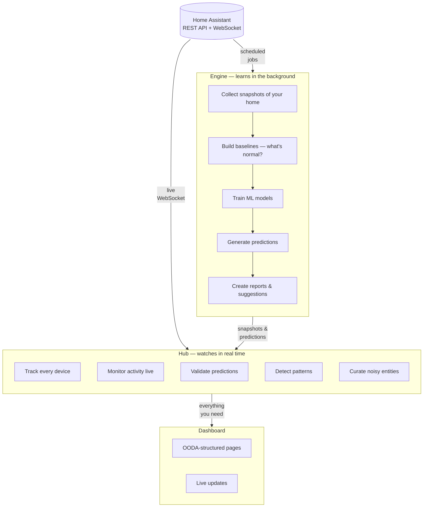
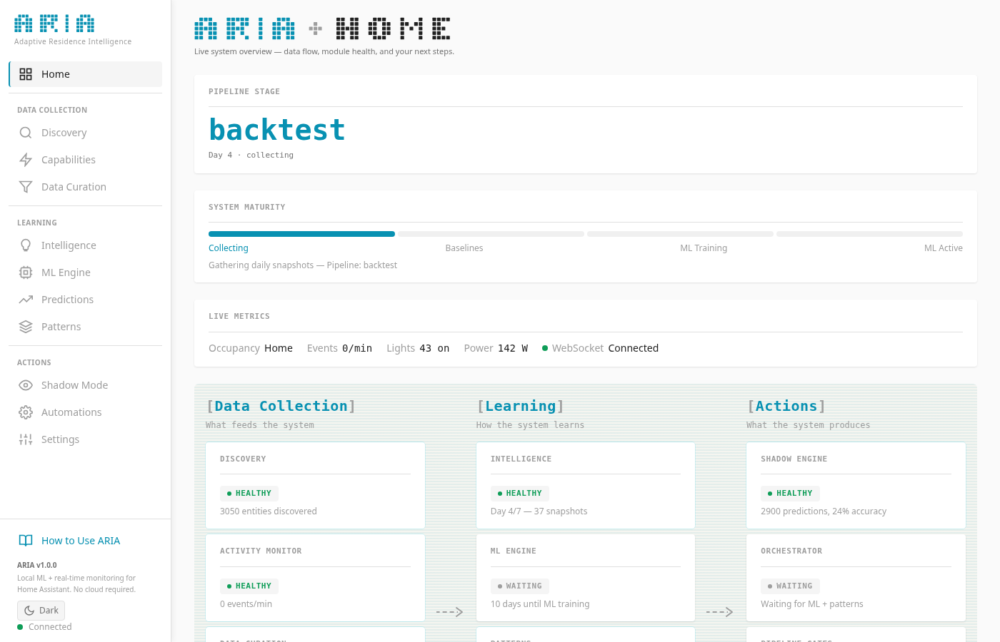
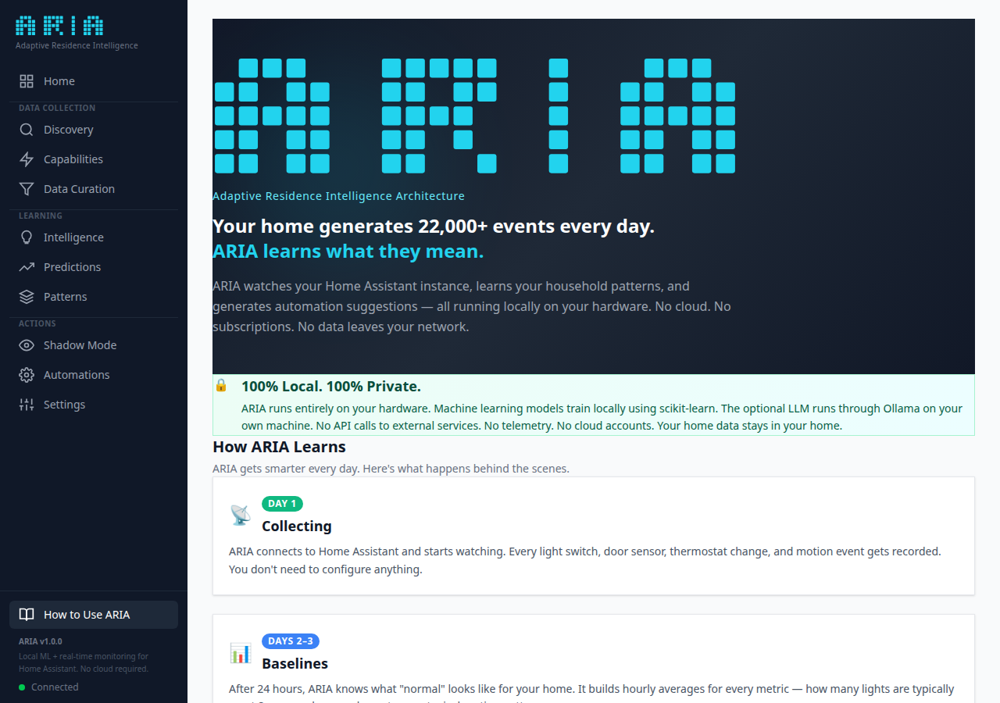
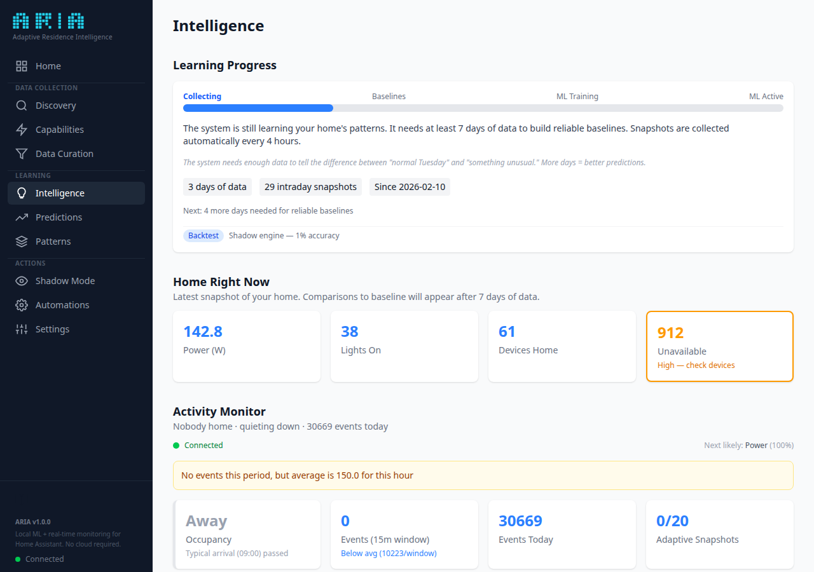
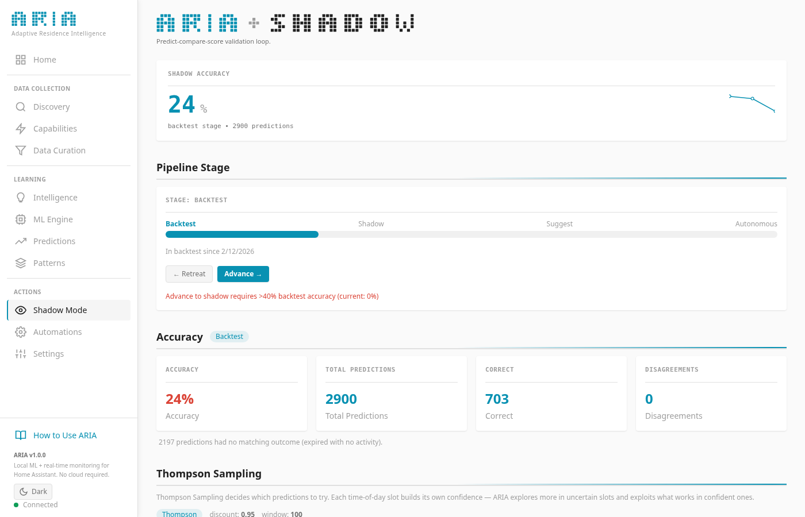

<div align="center">

<pre>
<b>   ████╗    ██████╗    ██╗    ████╗
  ██╔═██╗   ██╔══██╗   ██║   ██╔═██╗
 ██╔╝ ██║   ██████╔╝   ██║  ██╔╝ ██║
 ████████║   ██╔══██╗   ██║  ████████║
 ██╔╝ ╚██║   ██║  ██║   ██║  ██╔╝ ╚██║
 ╚═╝   ╚═╝   ╚═╝  ╚═╝   ╚═╝  ╚═╝   ╚═╝</b>
</pre>

### Adaptive Residence Intelligence Architecture

**Your home generates 22,000+ events every day.<br/>ARIA learns what they mean.**

[](https://github.com/parthalon025/ha-aria/actions/workflows/ci.yml)
[](https://github.com/parthalon025/ha-aria/actions)
[](https://www.python.org/)
[](https://opensource.org/licenses/MIT)

[Quick Start](#quick-start) · [Features](#features) · [Dashboard](#dashboard) · [Compatibility](#home-assistant-compatibility) · [FAQ](#faq) · [Research](RESEARCH.md)

</div>

---

## The Problem

Home Assistant is extraordinary at collecting data — every light switch, door sensor, thermostat adjustment, and motion event gets logged. But **collection isn't intelligence.**

Most HA users end up with:

- Hundreds of hand-written automations, one trigger at a time
- No idea which devices correlate, which patterns repeat, or what's abnormal
- Zero predictions — the system reacts but never anticipates

You're managing a smart home with a clipboard when you need a co-pilot.

## What ARIA Does

ARIA watches, learns, and predicts — **entirely on your local hardware.** No cloud. No subscriptions. No data leaving your network.

| Without ARIA | With ARIA |
|:---|:---|
| You write every automation by hand | ARIA detects patterns and generates ready-to-use YAML |
| Anomalies go unnoticed until something breaks | Statistical baselines flag unusual activity in real time |
| "Is someone home?" needs a dedicated sensor | Bayesian occupancy fuses motion, doors, lights, and media |
| Power consumption is a monthly surprise | Per-outlet profiling with cycle detection and trends |
| Predictions don't exist | ML models forecast what your home will do next |

## Features

### Learn

- **15 entity collectors** — power, climate, occupancy, locks, motion, EV charging, media, presence, and more
- **Statistical baselines** — hourly patterns with confidence ranges, built from your data
- **Entity correlation** — discover which devices activate together and when

### Predict

- **9 ML models** — gradient boosting, random forests, neural time-series, Markov chains, and more
- **Shadow mode** — predictions scored against reality before ARIA suggests anything
- **Drift detection** — automatically adapts when your home's patterns change

### Act

- **Automation suggestions** — ready-to-use Home Assistant YAML generated from detected patterns
- **Daily intelligence reports** — plain-English summaries delivered to Telegram
- **Self-tuning** — local LLM adjusts the learning pipeline based on prediction accuracy

### Watch

- **Real-time presence tracking** — per-room occupancy probability via Frigate cameras + HA sensors
- **Face recognition** — identify who's in each room (optional, via Frigate)
- **Watchdog** — health monitoring with auto-restart and Telegram alerts on failures

### See

- **OODA-structured interactive dashboard** with live WebSocket updates
- **Real-time activity monitor** — what's happening in your home right now
- **Presence dashboard** — room occupancy, signal feed, camera status, and face recognition
- **Layman-readable** — every chart includes a plain-English explanation

## Quick Start

### 1. Install

```bash
pip install ha-aria
```

Or from source:

```bash
git clone https://github.com/parthalon025/ha-aria.git
cd ha-aria
python3.12 -m venv .venv
source .venv/bin/activate
pip install -e ".[dev,llm,ml-extra,prophet]"
```

### 2. Configure

Create an environment file with your Home Assistant credentials:

```bash
# ~/.env (or export directly in your shell)
export HA_URL="http://your-ha-instance:8123"
export HA_TOKEN="your-long-lived-access-token"

# Optional: Telegram alerts (daily reports + watchdog alerts)
export TELEGRAM_BOT_TOKEN="your-bot-token"
export TELEGRAM_CHAT_ID="your-chat-id"

# Optional: MQTT for camera-based presence (requires Frigate)
export MQTT_HOST="your-mqtt-broker-ip"
export MQTT_USER="your-mqtt-user"
export MQTT_PASSWORD="your-mqtt-password"

# Optional: local LLM for reports and automation naming
export OLLAMA_API_KEY="ollama-local"
```

### 3. Build Dashboard

```bash
cd aria/dashboard/spa
npm install
npm run build
cd ../../..
```

### 4. Run

```bash
# Source your env file
source ~/.env

# Collect your first snapshot
aria snapshot

# Run the full pipeline (snapshot → predict → report)
aria full

# Start the real-time dashboard
aria serve
# → http://localhost:8001
```

ARIA starts learning immediately. Baselines form within 24 hours. ML predictions improve daily. Shadow mode validates accuracy before suggesting any automations.

### 5. (Optional) Run as a Service

For persistent operation, create a systemd user service:

```bash
# ~/.config/systemd/user/aria-hub.service
[Unit]
Description=ARIA Intelligence Hub
After=network-online.target

[Service]
Type=simple
ExecStart=/bin/bash -lc 'source ~/.env && /path/to/ha-aria/.venv/bin/aria serve'
Restart=on-failure
RestartSec=10

[Install]
WantedBy=default.target
```

```bash
systemctl --user daemon-reload
systemctl --user enable --now aria-hub
```

## How It Works

ARIA has two halves that work together:



- **Engine** runs in the background — collects data, trains models, generates predictions
- **Hub** watches your home in real time — tracks activity, validates predictions, detects patterns
- **Dashboard** shows you everything in a live web interface

### Learning Timeline

| Day | What Happens |
|-----|-------------|
| **1** | ARIA starts collecting snapshots every 4 hours |
| **2–3** | Baselines form — ARIA learns what "normal" looks like for each day of the week |
| **3–7** | ML models begin training on accumulated data |
| **7+** | Full predictions active, shadow mode validating accuracy |
| **14+** | Automation suggestions appear (only after accuracy thresholds are met) |

**You don't configure any of this.** ARIA advances through each stage automatically.

## Dashboard

The dashboard is organized around the **OODA loop** (Observe → Understand → Decide), with a Home page and System section:

| Section | Pages | What You See |
|---------|-------|-------------|
| **Home** | Pipeline flowchart | Live pipeline status — see what ARIA is doing right now |
| **Observe** | Discovery, Capabilities, Data Curation | What your home has — entities, devices, areas, and which ones ARIA watches |
| **Understand** | Intelligence, Predictions, Patterns, Shadow Mode | What it means — baselines, forecasts, sequences, and prediction accuracy |
| **Decide** | ML Engine, Automations, Presence | What to do about it — model health, automation YAML, room occupancy |
| **System** | Settings, Validation, Guide | Administration — thresholds, integrity checks, and onboarding |

<div align="center">

| Home | Guide |
|:---:|:---:|
|  |  |

| Intelligence | Shadow Mode |
|:---:|:---:|
|  |  |

</div>

## CLI Reference

| Command | What It Does |
|---------|-------------|
| `aria serve` | Start the dashboard and real-time monitoring |
| `aria full` | Run the full learning pipeline |
| `aria snapshot` | Capture current state of your home |
| `aria predict` | Generate tomorrow's predictions |
| `aria score` | See how yesterday's predictions did |
| `aria retrain` | Retrain all ML models |
| `aria check-drift` | Check if your home's patterns have changed |
| `aria correlations` | Find which devices activate together |
| `aria sequences train` | Learn event sequences from your logbook |
| `aria sequences detect` | Find unusual event sequences |
| `aria suggest-automations` | Generate automation YAML from patterns |
| `aria prophet` | Train seasonal forecasters |
| `aria occupancy` | Estimate who's home |
| `aria power-profiles` | Analyze power consumption per outlet |
| `aria sync-logs` | Sync HA logbook to local storage |
| `aria audit` | Run integrity checks and verification |
| `aria snapshot-intraday` | Capture lightweight intraday snapshot |
| `aria meta-learn` | Run meta-learning pipeline to tune ARIA |
| `aria watchdog` | Run health checks and alert on failures |
| `aria status` | Show ARIA hub status |
| `aria capabilities list` | List all registered capabilities |
| `aria capabilities verify` | Validate capability declarations |
| `aria demo` | Generate synthetic data for visual testing |

## Home Assistant Compatibility

ARIA works with **any Home Assistant installation** — HAOS, Docker, Core, Supervised. It connects via the official REST API and WebSocket API, so it runs alongside your existing setup without modifying it.

| | |
|:---|:---|
| **Installation types** | HAOS, Docker, Core, Supervised |
| **Connection** | REST API + WebSocket (long-lived access token) |
| **Entities supported** | All domains — lights, switches, sensors, locks, climate, media, covers, presence, power monitoring |
| **Protocols** | Works with Zigbee, Z-Wave, Matter, Thread, WiFi — anything HA can see |
| **Minimum HA version** | 2023.1+ (WebSocket API v2) |
| **Privacy** | All data stays on your network. No cloud. No telemetry. No account required. |
| **Resource usage** | ~200MB RAM idle, ~2GB during ML training (configurable caps via systemd) |

ARIA doesn't replace your existing automations — it **learns from them** and suggests new ones based on patterns it discovers.

## Requirements

- **Python** >= 3.12
- **Node.js** >= 20 (for dashboard build only)
- **Home Assistant** instance with a [long-lived access token](https://developers.home-assistant.io/docs/auth_api/#long-lived-access-token)
- **Optional:** [Ollama](https://ollama.ai/) for LLM features (daily reports, automation naming, meta-learning)
- **Optional:** [Frigate NVR](https://frigate.video/) + MQTT broker for camera-based presence detection
- **Optional:** LightGBM, Prophet, NeuralProphet for extended ML capabilities

## FAQ

**Does ARIA modify my Home Assistant configuration?**
No. ARIA is read-only — it connects via the official API and WebSocket, observes your home's state, and presents insights through its own dashboard. Your HA config, automations, and entities are never touched.

**How long until I see useful predictions?**
Baselines form within 24–48 hours. ML models begin training at day 7 with reliable predictions by day 14. Shadow mode validates everything before surfacing suggestions.

**Can I run ARIA on a Raspberry Pi?**
ARIA's hub runs comfortably on a Pi 4 (4GB+). ML training jobs are heavier — schedule them during off-peak hours or run them on a separate machine that connects to the same HA instance.

**Does it work with Zigbee/Z-Wave/Matter/Thread devices?**
Yes. ARIA works at the entity level — it doesn't care how devices connect to HA. If HA can see the entity, ARIA can learn from it.

**What about privacy?**
Everything runs locally. No cloud services, no accounts, no telemetry, no data leaves your network. LLM features use local Ollama models.

**How is this different from HA's built-in statistics?**
HA tracks individual entity history. ARIA finds patterns *across* entities, predicts future behavior, detects anomalies, and generates automations. It's the difference between a thermometer and a weather forecast.

## Project

| | |
|:---|:---|
| **Tests** | 1,607 passing (CI-enforced) |
| **Code** | 24,086 lines across 89 Python files |
| **Dashboard** | 71 JSX components across 19 pages |
| **Hub modules** | 10 registered (discovery, ML engine, patterns, shadow engine, orchestrator, trajectory classifier, intelligence, activity monitor, presence, audit logger) |
| **CI** | Lint → Test (Python 3.12 + 3.13) → Dashboard build |

## For Researchers

ARIA's ML pipeline is grounded in peer-reviewed research — Thompson Sampling, SHAP explainability, ensemble drift detection, and more.

**See [RESEARCH.md](RESEARCH.md)** for the full technical overview, model details, research foundations, and citation information.

## Contributing

See [CONTRIBUTING.md](CONTRIBUTING.md) for development setup and guidelines.

```bash
git clone https://github.com/parthalon025/ha-aria.git
cd ha-aria
python3.12 -m venv .venv
source .venv/bin/activate
pip install -e ".[dev,llm,ml-extra,prophet]"

# Run tests
pytest tests/ -v

# Lint
ruff check . && ruff format --check .
```

## License

[MIT](LICENSE) — Justin McFarland, 2026
