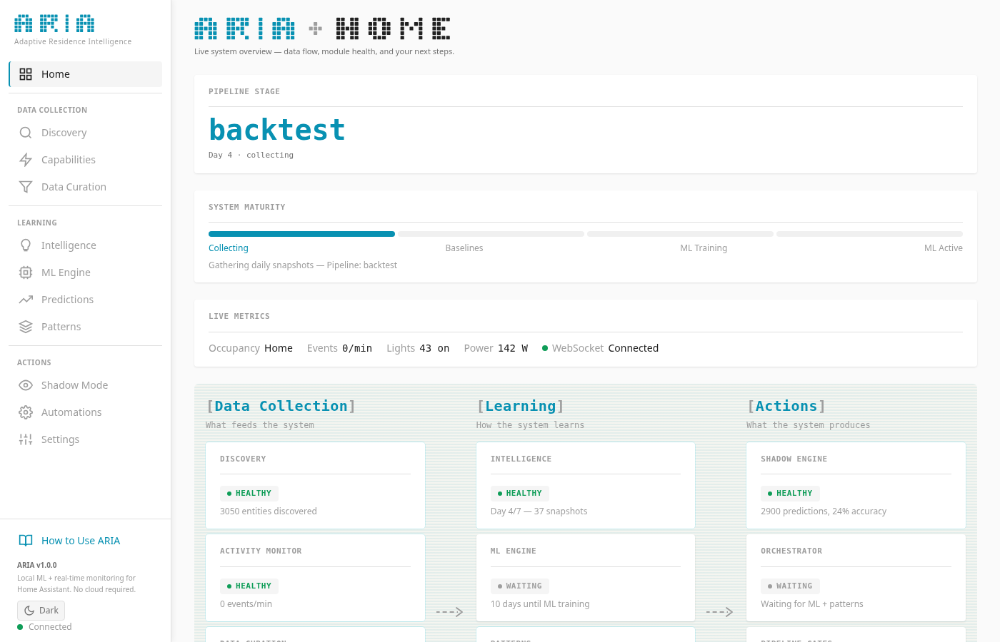
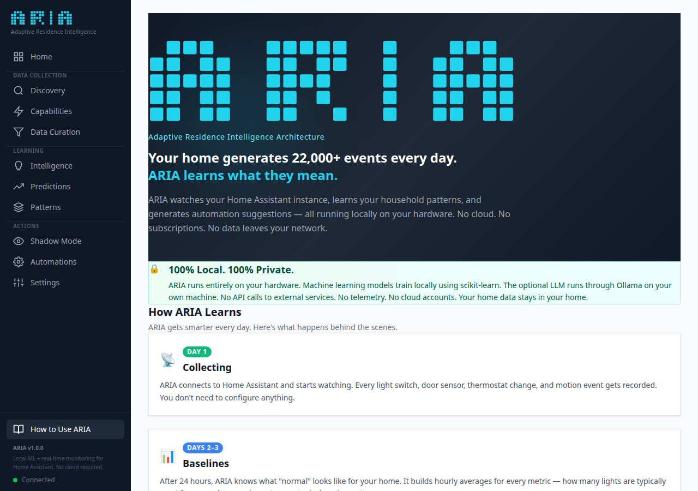
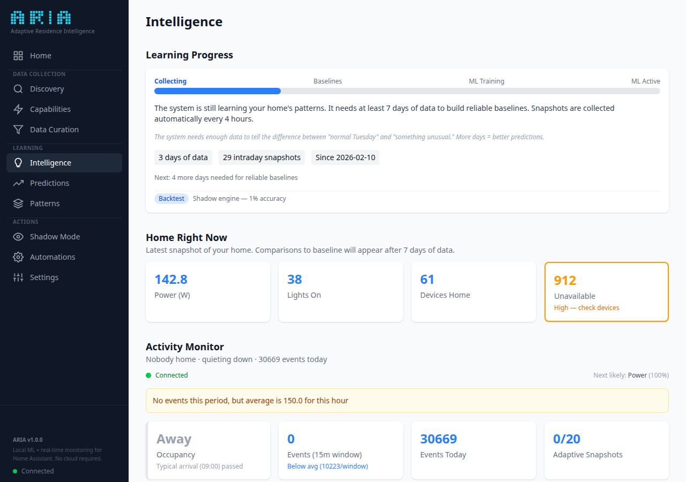
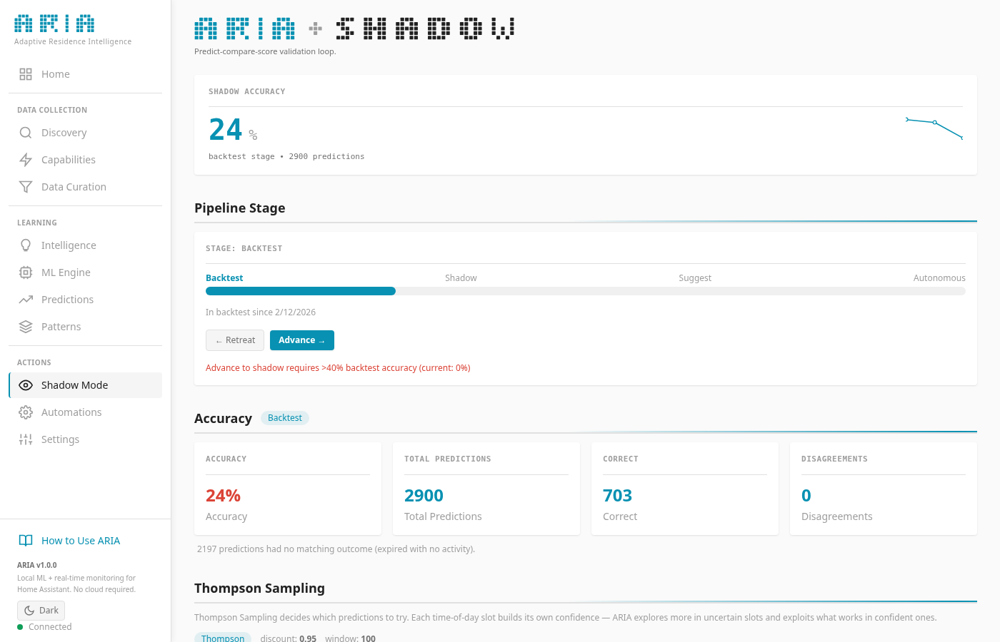

# ARIA — Adaptive Residence Intelligence Architecture

**Your home generates 22,000+ events every day. ARIA learns what they mean.**

<div align="center">

<pre>
<b>   ████╗    ██████╗    ██╗    ████╗
  ██╔═██╗   ██╔══██╗   ██║   ██╔═██╗
 ██╔╝ ██║   ██████╔╝   ██║  ██╔╝ ██║
 ████████║   ██╔══██╗   ██║  ████████║
 ██╔╝ ╚██║   ██║  ██║   ██║  ██╔╝ ╚██║
 ╚═╝   ╚═╝   ╚═╝  ╚═╝   ╚═╝  ╚═╝   ╚═╝</b>
</pre>

[](https://github.com/parthalon025/ha-aria/actions/workflows/ci.yml)
[](https://github.com/parthalon025/ha-aria/actions)
[](https://www.python.org/)
[](https://opensource.org/licenses/MIT)

[Quick Start](#quick-start) · [Architecture](#architecture) · [Features](#features) · [Dashboard](#dashboard) · [CLI Reference](#cli-reference) · [Compatibility](#home-assistant-compatibility) · [FAQ](#faq) · [Research](RESEARCH.md)

</div>

---

## The Problem

HA gives you raw event data. It doesn't tell you what it means. Your home is logging thousands of state changes every day — lights, motion, doors, thermostats, media — but that data sits in a database, not a brain. **ARIA learns the patterns in your home's behavior and surfaces what matters: who's home, what's anomalous, what automations to suggest.**

Most HA users end up with:

- Hundreds of hand-written automations, one trigger at a time
- No idea which devices correlate, which patterns repeat, or what's abnormal
- Zero predictions — the system reacts but never anticipates

You're managing a smart home with a clipboard when you need a co-pilot.

## What ARIA Does

ARIA is a unified intelligence platform that sits alongside your Home Assistant installation, learning your home's patterns and surfacing actionable insights — **entirely on your local hardware.** No cloud. No subscriptions. No data leaving your network.

| Without ARIA | With ARIA |
|:---|:---|
| You write every automation by hand | ARIA detects patterns and generates ready-to-use YAML |
| Anomalies go unnoticed until something breaks | Statistical baselines flag unusual activity in real time |
| "Is someone home?" needs a dedicated sensor | Bayesian occupancy fuses motion, doors, lights, and media |
| Power consumption is a monthly surprise | Per-outlet profiling with cycle detection and trends |
| Predictions don't exist | ML models forecast what your home will do next |
| Model selection is manual and static | Thompson Sampling MAB routing picks the best-performing model automatically |

---

## Who This Is For

**This is for you if:**
- You're a Home Assistant user who wants ML-powered presence detection, pattern recognition, and anomaly alerts — without sending data to a cloud AI service
- You're a developer who wants to see how Bayesian sensor fusion, Thompson Sampling model routing, and FSRS-based reinforcement learning work in a real production system — not a toy

**This is not for you if:**
- You're new to Home Assistant — ARIA requires comfort with HA configuration, long-lived access tokens, and systemd services
- You want a one-click install — this is a Python application you run alongside HA, not an add-on

---

## Architecture

ARIA is built around two halves that run continuously side by side:

```
┌─────────────────────────────────────────────────────────────────┐
│                     Home Assistant                               │
│              REST API + WebSocket (22k+ events/day)             │
└────────────────────┬────────────────────────┬───────────────────┘
                     │ scheduled polls         │ live WebSocket stream
                     ▼                         ▼
┌────────────────────────────┐   ┌─────────────────────────────────┐
│         ML Engine          │   │       Intelligence Hub          │
│  (batch, runs on schedule) │   │  (real-time, always listening)  │
│                            │   │                                 │
│  • 15 entity collectors    │   │  • WebSocket event consumer     │
│  • Statistical baselines   │   │  • Bayesian sensor fusion       │
│  • 9 ML models             │   │  • Activity monitor             │
│  • Drift detection         │   │  • Shadow mode validation       │
│  • Automation suggestions  │   │  • Presence tracking            │
│  • MAB model routing       │   │  • UniFi network presence       │
│  • Prediction scoring      │   │  • Pattern detection            │
└──────────────┬─────────────┘   └──────────────┬──────────────────┘
               │ JSON snapshots                  │ real-time cache
               └──────────────┬──────────────────┘
                              ▼
              ┌───────────────────────────────┐
              │      Preact Dashboard         │
              │  (OODA-structured, live WS)   │
              │                               │
              │  Observe → Orient → Decide    │
              │  Every chart: plain English   │
              └───────────────────────────────┘
```

### Signal Pipeline

The hub processes every Home Assistant state change through a layered pipeline:

```
HA WebSocket event
    → Entity curation (domain filter + noise suppression)
    → Bayesian fusion (motion + doors + lights + media + network)
    → Presence scoring (per-room occupancy probability)
    → Shadow engine (prediction vs. reality comparison)
    → Cache update + WebSocket push to dashboard
```

**UniFi integration** adds a dedicated network presence signal: client association events from UniFi switches and cameras feed directly into Bayesian occupancy fusion alongside HA sensors.

### MAB Model Routing

ARIA uses **Thompson Sampling** (a multi-armed bandit algorithm) to route predictions to the best-performing ML model at inference time. Each model accumulates a Beta distribution over its prediction accuracy. The router samples from those distributions and selects the model with the highest sampled quality — automatically favoring models that have proven accurate on your home's data without requiring manual tuning.

---

## Features

### Learn

- **15 entity collectors** — power, climate, occupancy, locks, motion, EV charging, media, presence, and more
- **Statistical baselines** — hourly patterns with confidence ranges, built from your actual data
- **Entity correlation** — discover which devices activate together and in what sequences
- **FSRS-powered lesson retention** — spaced repetition baked into the meta-learning pipeline

### Predict

- **9 ML models** — gradient boosting, random forests, neural time-series, Markov chains, and more
- **Shadow mode** — every prediction is scored against reality before ARIA surfaces suggestions
- **Drift detection** — automatically detects when your home's patterns have shifted and retrains
- **Known-answer regression suite** — 37 deterministic golden-snapshot tests across all 10 modules

### Route

- **Thompson Sampling MAB** — competing ML models, online quality tracking, automatic winner selection
- **LLM judge integration** — routes complex natural-language tasks through Ollama with priority and retry
- **Queue-backed inference** — all Ollama tasks submit through ollama-queue for VRAM-aware scheduling

### Sense

- **Bayesian sensor fusion** — combines motion, door, light, media, and network signals into per-room occupancy probability
- **UniFi presence** — REST polling (network clients) + WebSocket (Protect camera events) feed `network_client_present` and `protect_person` signals into fusion
- **Media player signals** — Sonos/Apple TV play states contribute `media_active` presence without requiring a room camera
- **Face recognition** — per-person room assignment via Frigate (optional)

### Act

- **Automation suggestions** — ready-to-use Home Assistant YAML generated from detected patterns
- **Daily intelligence reports** — plain-English summaries delivered to Telegram
- **Self-tuning** — local LLM adjusts the learning pipeline based on measured prediction accuracy
- **Watchdog** — health monitoring with auto-restart and Telegram alerts on failures

### See

- **OODA-structured interactive dashboard** with live WebSocket updates
- **14 hub modules** — discovery, ML engine, patterns, shadow engine, orchestrator, trajectory classifier, intelligence, activity monitor, presence, UniFi, automation generator, anomaly explainer, attention explainer, and more
- **Every chart includes a plain-English explanation** — no chart without context
- **Pipeline Sankey diagram** — live visualization of data flow through the entire system

---

## Tech Stack

| Layer | Technology |
|:---|:---|
| **Runtime** | Python 3.12+, asyncio |
| **ML** | scikit-learn, LightGBM, Prophet, NeuralProphet, numpy |
| **API server** | FastAPI + uvicorn |
| **Real-time** | WebSocket (aiohttp client to HA, asyncio server to dashboard) |
| **Database** | SQLite (hub cache, snapshot log as JSONL) |
| **Dashboard** | Preact, esbuild, JSX |
| **Spaced repetition** | FSRS-6 (meta-learning layer) |
| **LLM backend** | Ollama (local, queue-backed) |
| **Network presence** | UniFi REST + WebSocket APIs |
| **Camera presence** | Frigate NVR + MQTT |
| **Testing** | pytest, pytest-xdist (2458 tests, parallel across 6 workers) |
| **CI** | GitHub Actions — lint → test (Python 3.12 + 3.13) → dashboard build |

---

## Prerequisites

- **Home Assistant** running (any install type: HAOS, Docker, Core, Supervised)
- **Python 3.12+** on the machine where ARIA will run
- **Ollama** running locally — required for LLM features (daily reports, automation naming, meta-learning)
- **A long-lived HA access token** — generate one in HA under Profile → Long-Lived Access Tokens
- **Recommended:** UniFi network equipment for network-based presence detection (optional — ARIA works without it, but presence accuracy improves significantly)

---

## Quick Start

### 1. Install

From source:

```bash
git clone https://github.com/parthalon025/ha-aria.git
cd ha-aria
python3.12 -m venv .venv
source .venv/bin/activate
pip install -e ".[dev,llm,ml-extra,prophet]"
```

### 2. Configure

Create an environment file with your Home Assistant credentials:

```bash
# ~/.env (or export directly in your shell)
export HA_URL="http://<ha-host>:8123"
export HA_TOKEN="<your-long-lived-access-token>"

# Optional: Telegram alerts (daily reports + watchdog alerts)
export TELEGRAM_BOT_TOKEN="<your-bot-token>"
export TELEGRAM_CHAT_ID="<your-chat-id>"

# Optional: MQTT for camera-based presence (requires Frigate)
export MQTT_HOST="<your-mqtt-broker>"
export MQTT_USER="<your-mqtt-user>"
export MQTT_PASSWORD="<your-mqtt-password>"

# Optional: local LLM for reports and automation naming
export OLLAMA_API_KEY="ollama-local"
```

Generate a long-lived access token in Home Assistant under **Profile → Long-Lived Access Tokens**.

### 3. Build Dashboard

```bash
cd aria/dashboard/spa
npm install
npm run build
cd ../../..
```

### 4. Run

```bash
# Source your env file
source ~/.env

# Collect your first snapshot
aria snapshot

# Run the full pipeline (snapshot → predict → report)
aria full

# Start the real-time dashboard and hub
aria serve
# → http://localhost:8001/ui/
```

ARIA starts learning immediately. Baselines form within 24 hours. ML predictions improve daily. Shadow mode validates accuracy before surfacing any automation suggestions.

### 5. Run as a Service

For persistent operation, install as a systemd user service:

```bash
# Create ~/.config/systemd/user/aria-hub.service
[Unit]
Description=ARIA Intelligence Hub
After=network-online.target

[Service]
Type=simple
ExecStart=/bin/bash -lc 'source %h/.env && %h/ha-aria/.venv/bin/aria serve'
Restart=on-failure
RestartSec=10

[Install]
WantedBy=default.target
```

```bash
systemctl --user daemon-reload
systemctl --user enable --now aria-hub
```

---

## Learning Timeline

| Day | What Happens |
|:---:|:---|
| **1** | ARIA collects snapshots every 4 hours; entity discovery runs immediately |
| **2–3** | Statistical baselines form — ARIA learns "normal" for each hour and day of the week |
| **3–7** | ML models begin training on accumulated snapshots |
| **7+** | Full predictions active; shadow mode scores every prediction against reality |
| **14+** | Automation suggestions appear — only after accuracy thresholds are met |

**You don't configure any of this.** ARIA advances through each stage automatically.

---

## Dashboard

The dashboard is organized around the **OODA loop** (Observe → Orient → Decide), with a Home page and System section:

| Section | Pages | What You See |
|:---|:---|:---|
| **Home** | Pipeline flowchart | Live Sankey diagram of pipeline data flow and module status |
| **Observe** | Discovery, Capabilities, Data Curation | All entities, devices, and areas — what ARIA watches and why |
| **Orient** | Intelligence, Predictions, Patterns, Shadow Mode | Baselines, forecasts, event sequences, and prediction accuracy |
| **Decide** | ML Engine, Automations, Presence | Model health, automation YAML, and per-room occupancy |
| **System** | Settings, Validation, Guide | Thresholds, integrity checks, and onboarding walkthrough |

Every chart on every page includes a plain-English explanation beneath it. ARIA is built to be readable by anyone, not just the person who installed it.

<div align="center">

| Home | Guide |
|:---:|:---:|
|  |  |

| Intelligence | Shadow Mode |
|:---:|:---:|
|  |  |

</div>

---

## CLI Reference

| Command | What It Does |
|:---|:---|
| `aria serve` | Start the dashboard and real-time hub |
| `aria full` | Run the full learning pipeline (snapshot → train → predict → report) |
| `aria snapshot` | Capture current state of your home |
| `aria predict` | Generate predictions for the next period |
| `aria score` | See how yesterday's predictions performed |
| `aria retrain` | Retrain all ML models |
| `aria check-drift` | Detect if your home's patterns have changed |
| `aria correlations` | Find devices that activate together |
| `aria sequences train` | Learn event sequences from the HA logbook |
| `aria sequences detect` | Detect unusual event sequences |
| `aria suggest-automations` | Generate automation YAML from discovered patterns |
| `aria prophet` | Train seasonal forecasters |
| `aria occupancy` | Estimate current occupancy via Bayesian fusion |
| `aria power-profiles` | Analyze power consumption per outlet |
| `aria sync-logs` | Sync HA logbook to local storage |
| `aria audit` | Run integrity checks and verification |
| `aria snapshot-intraday` | Capture a lightweight intraday snapshot |
| `aria meta-learn` | Run meta-learning pipeline to tune ARIA |
| `aria watchdog` | Run health checks and alert on failures |
| `aria status` | Show hub status and module health |
| `aria capabilities list` | List all registered capabilities |
| `aria capabilities verify` | Validate capability declarations |
| `aria demo` | Generate synthetic data for visual testing |

---

## Home Assistant Compatibility

ARIA works with **any Home Assistant installation** — HAOS, Docker, Core, Supervised. It connects via the official REST and WebSocket APIs, running alongside your existing setup without modifying it.

| | |
|:---|:---|
| **Installation types** | HAOS, Docker, Core, Supervised |
| **Connection** | REST API + WebSocket (long-lived access token) |
| **Entities supported** | All domains — lights, switches, sensors, locks, climate, media, covers, presence, power monitoring |
| **Protocols** | Works with Zigbee, Z-Wave, Matter, Thread, WiFi — anything HA can see |
| **Minimum HA version** | 2023.1+ (WebSocket API v2) |
| **Privacy** | All data stays on your network. No cloud. No telemetry. No account required. |
| **Resource usage** | ~200MB RAM idle, ~2GB during ML training (configurable via systemd memory caps) |

ARIA doesn't replace your existing automations — it **learns from them** and suggests new ones based on patterns it discovers.

---

## Requirements

- **Python** >= 3.12
- **Node.js** >= 20 (dashboard build only)
- **Home Assistant** with a [long-lived access token](https://developers.home-assistant.io/docs/auth_api/#long-lived-access-token)
- **Optional:** [Ollama](https://ollama.ai/) for LLM features (daily reports, automation naming, meta-learning)
- **Optional:** [Frigate NVR](https://frigate.video/) + MQTT broker for camera-based presence detection
- **Optional:** UniFi controller for network presence signals
- **Optional:** LightGBM, Prophet, NeuralProphet for extended ML model coverage

---

## Project Stats

| | |
|:---|:---|
| **Tests** | 2,458 passing (CI-enforced, parallel execution via pytest-xdist) |
| **Test suites** | Hub (~1,540), Engine (~485), Integration (~237 including 37 golden-snapshot regression tests) |
| **Hub modules** | 14 registered (discovery, ML engine, patterns, shadow engine, orchestrator, trajectory classifier, intelligence, activity monitor, presence, UniFi, automation generator, anomaly explainer, attention explainer, audit logger) |
| **Dashboard** | Preact SPA — multiple pages across OODA structure |
| **CI** | Lint → Test (Python 3.12 + 3.13) → Dashboard build |

---

## FAQ

**Does ARIA modify my Home Assistant configuration?**
No. ARIA is read-only — it connects via the official API and WebSocket, observes your home's state, and presents insights through its own dashboard. Your HA config, automations, and entities are never touched.

**How long until I see useful predictions?**
Baselines form within 24–48 hours. ML models begin training at day 7 with reliable predictions by day 14. Shadow mode validates everything before surfacing suggestions.

**Can I run ARIA on a Raspberry Pi?**
ARIA's hub runs comfortably on a Pi 4 (4GB+). ML training jobs are heavier — schedule them during off-peak hours or run them on a separate machine connected to the same HA instance.

**Does it work with Zigbee/Z-Wave/Matter/Thread devices?**
Yes. ARIA works at the entity level — it doesn't care how devices connect to HA. If HA can see the entity, ARIA can learn from it.

**What about privacy?**
Everything runs locally. No cloud services, no accounts, no telemetry, no data leaves your network. LLM features use local Ollama models.

**How is this different from HA's built-in statistics?**
HA tracks individual entity history. ARIA finds patterns *across* entities, predicts future behavior, detects anomalies, fuses multiple signal types into occupancy probabilities, and generates automations. It's the difference between a thermometer and a weather forecast.

**What is Thompson Sampling / MAB?**
Multi-Armed Bandit (MAB) is a reinforcement learning technique for selecting the best option under uncertainty. ARIA uses Thompson Sampling to dynamically route predictions to the ML model that has performed best on your home's specific data — no manual model selection required.

---

## For Researchers

ARIA's ML pipeline is grounded in peer-reviewed research — Thompson Sampling, SHAP explainability, ensemble drift detection, Bayesian fusion, and FSRS-6 spaced repetition.

See [RESEARCH.md](RESEARCH.md) for the full technical overview, model details, research foundations, and citation information.

---

## Contributing

See [CONTRIBUTING.md](CONTRIBUTING.md) for development setup and guidelines.

```bash
git clone https://github.com/parthalon025/ha-aria.git
cd ha-aria
python3.12 -m venv .venv
source .venv/bin/activate
pip install -e ".[dev,llm,ml-extra,prophet]"

# Run tests (parallel)
.venv/bin/python -m pytest tests/ -v --timeout=120

# Lint
ruff check . && ruff format --check .
```

---

## License

[MIT](LICENSE) — Justin McFarland, 2026
