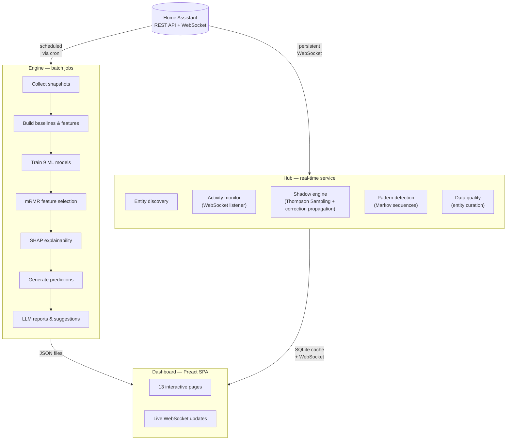

<div align="center">

<pre>
<b>   ████╗    ██████╗    ██╗    ████╗
  ██╔═██╗   ██╔══██╗   ██║   ██╔═██╗
 ██╔╝ ██║   ██████╔╝   ██║  ██╔╝ ██║
 ████████║   ██╔══██╗   ██║  ████████║
 ██╔╝ ╚██║   ██║  ██║   ██║  ██╔╝ ╚██║
 ╚═╝   ╚═╝   ╚═╝  ╚═╝   ╚═╝  ╚═╝   ╚═╝</b>
</pre>

### Adaptive Residence Intelligence Architecture

**Your home generates 22,000+ events every day.<br/>ARIA learns what they mean.**

[](https://github.com/parthalon025/ha-aria/actions/workflows/ci.yml)
[](https://github.com/parthalon025/ha-aria/actions)
[](https://www.python.org/)
[](https://opensource.org/licenses/MIT)

[Quick Start](#quick-start) · [Features](#features) · [Architecture](#architecture) · [Dashboard](#dashboard) · [CLI](#cli-reference) · [Contributing](#contributing)

</div>

---

## The Problem

Home Assistant is extraordinary at collecting data — every light switch, door sensor, thermostat adjustment, and motion event gets logged. But **collection isn't intelligence.**

Most HA users end up with:

- Hundreds of hand-written automations, one trigger at a time
- No idea which devices correlate, which patterns repeat, or what's abnormal
- Zero predictions — the system reacts but never anticipates

You're managing a smart home with a clipboard when you need a co-pilot.

## What ARIA Does

ARIA watches, learns, and predicts — **entirely on your local hardware.** No cloud. No subscriptions. No data leaving your network.

| Without ARIA | With ARIA |
|:---|:---|
| You write every automation by hand | ARIA detects patterns and generates ready-to-use YAML |
| Anomalies go unnoticed until something breaks | Statistical baselines flag unusual activity in real time |
| "Is someone home?" needs a dedicated sensor | Bayesian occupancy fuses motion, doors, lights, and media |
| Power consumption is a monthly surprise | Per-outlet profiling with cycle detection and trends |
| Predictions don't exist | 9 ML models forecast what your home will do next |

## Features

### Learn

- **15 entity collectors** — power, climate, occupancy, locks, motion, EV charging, media, and more
- **Statistical baselines** — hourly patterns with confidence ranges, built from your data
- **Entity correlation** — discover which devices activate together and when

### Predict

- **9 ML models** — GradientBoosting, RandomForest, IsolationForest, Prophet, NeuralProphet, LightGBM, Markov chains, Bayesian occupancy, hybrid autoencoder
- **Shadow mode** — predictions scored against reality with Thompson Sampling exploration and adaptive correction propagation
- **Concept drift detection** — ensemble detection using Page-Hinkley, ADWIN, and rolling threshold methods
- **SHAP explainability** — per-prediction feature attributions explain why ARIA made each prediction
- **mRMR feature selection** — minimum Redundancy Maximum Relevance selects the most informative signals

### Act

- **Automation suggestions** — LLM-generated Home Assistant YAML from detected patterns
- **Meta-learning** — local Ollama tunes feature engineering based on prediction accuracy
- **Daily intelligence reports** — LLM-summarized insights delivered to Telegram

### See

- **13-page interactive dashboard** — Preact SPA with live WebSocket updates, ASCII pixel-art page banners, terminal aesthetic
- **Data-forward visualizations** — sparkline KPIs, heatmap baselines, correlation matrices, swim-lane timelines
- **Small multiples** — each metric gets its own chart at its own scale (Tufte-inspired)
- **Real-time activity monitor** — swim-lane timeline + 15-minute windowed analysis
- **Shadow accuracy tracking** — rolling 7-day accuracy line with prediction volume and gate thresholds
- **Layman-readable** — every chart includes a plain-English explanation and color legend
- **ML Engine dashboard** — feature selection rankings, reference model comparison, incremental training status
- **Drift & anomaly visualization** — per-metric drift status, anomaly alerts, autoencoder health
- **SHAP attribution charts** — horizontal bar charts showing feature influence on predictions

## Quick Start

### 1. Install

```bash
pip install ha-aria
```

Or from source:

```bash
git clone https://github.com/parthalon025/ha-aria.git
cd ha-aria
python3.12 -m venv .venv
source .venv/bin/activate
pip install -e ".[dev,llm,ml-extra,prophet]"
```

### 2. Connect

```bash
export HA_URL="http://your-ha-instance:8123"
export HA_TOKEN="your-long-lived-access-token"
```

### 3. Run

```bash
# Collect your first snapshot
aria snapshot

# Run the full pipeline (snapshot → predict → report)
aria full

# Start the real-time dashboard
aria serve
# → http://localhost:8001
```

ARIA starts learning immediately. Baselines form within 24 hours. ML predictions improve daily. Shadow mode validates accuracy before suggesting any automations.

## Architecture

ARIA has two halves that work together:



- **Engine** runs as scheduled batch jobs — collects data, trains models, generates predictions, produces LLM reports
- **Hub** runs as a persistent service — monitors real-time activity via WebSocket, validates predictions in shadow mode, detects patterns
- **Dashboard** presents everything in a live Preact SPA with WebSocket-pushed updates

### How It Learns

ARIA's learning pipeline advances automatically through four stages:


**Shadow mode** is the safety net: ARIA makes predictions silently, compares them to what actually happens, and only suggests automations when accuracy thresholds are met. You stay in control.

## Dashboard

The dashboard ships with 13 pages covering the full intelligence pipeline:

| Page | What You See |
|------|-------------|
| **Home** | 3-lane pipeline flowchart with live status chips and journey progress |
| **Discovery** | Every entity, device, and area HA knows about |
| **Capabilities** | Detected home capabilities (lighting, climate, presence, etc.) |
| **Data Curation** | Entity-level include/exclude tiering for noise control |
| **Intelligence** | Heatmap baselines, small-multiple trends, correlation matrix, swim-lane activity, LLM insights |
| **Predictions** | ML model outputs with confidence scores |
| **Patterns** | Recurring event sequences detected from your logbook |
| **Shadow Mode** | Dual accuracy chart (rolling line + volume bars), disagreements, pipeline gates |
| **ML Engine** | Feature selection rankings, model health, incremental training, reference model comparison |
| **Automations** | LLM-suggested HA automation YAML from detected patterns |
| **Settings** | Tunable parameters — retraining schedules, thresholds, model config |
| **Guide** | Interactive onboarding — how ARIA learns, what each page does, FAQ |

<div align="center">

| Home | Guide |
|:---:|:---:|
|  |  |

| Intelligence | Shadow Mode |
|:---:|:---:|
|  |  |

</div>

## CLI Reference

| Command | Description |
|---------|-------------|
| `aria serve` | Start real-time hub + dashboard |
| `aria full` | Full daily pipeline (snapshot → predict → report) |
| `aria snapshot` | Collect current HA state |
| `aria predict` | Generate predictions from latest snapshot |
| `aria score` | Score yesterday's predictions against actuals |
| `aria retrain` | Retrain all ML models |
| `aria meta-learn` | LLM meta-learning to tune feature config |
| `aria check-drift` | Ensemble drift detection (Page-Hinkley + ADWIN + threshold) |
| `aria correlations` | Entity co-occurrence analysis |
| `aria sequences train` | Train Markov chain model from logbook |
| `aria sequences detect` | Detect anomalous event sequences |
| `aria suggest-automations` | Generate HA automation YAML via LLM |
| `aria prophet` | Train Prophet seasonal forecasters |
| `aria occupancy` | Bayesian occupancy estimation |
| `aria power-profiles` | Per-outlet power consumption analysis |
| `aria sync-logs` | Sync HA logbook to local storage |

## Requirements

- **Python** >= 3.12
- **Home Assistant** instance with a [long-lived access token](https://developers.home-assistant.io/docs/auth_api/#long-lived-access-token)
- **Optional:** [Ollama](https://ollama.ai/) for LLM features (daily reports, meta-learning, automation suggestions)
- **Optional:** LightGBM, Prophet for extended ML capabilities

## Project

| | |
|:---|:---|
| **Tests** | 747 (747 passing, CI-enforced) |
| **Code** | 14,451 lines across 63 Python files |
| **Dashboard** | 44 JSX components across 13 pages |
| **Hub modules** | 8 registered (discovery, ML, patterns, shadow, orchestrator, data quality, intelligence, activity) |
| **CI** | Lint → Test (Python 3.12 + 3.13) → Dashboard build → Codecov |

### Built With

[scikit-learn](https://scikit-learn.org/) · [FastAPI](https://fastapi.tiangolo.com/) · [Preact](https://preactjs.com/) · [Tailwind CSS](https://tailwindcss.com/) · [Prophet](https://facebook.github.io/prophet/) · [Ollama](https://ollama.ai/) · [LightGBM](https://lightgbm.readthedocs.io/) · [SHAP](https://shap.readthedocs.io/) · [river](https://riverml.xyz/) · [NeuralProphet](https://neuralprophet.com/)

### Research Foundations

ARIA's ML pipeline is grounded in peer-reviewed research:

| Technique | Paper | Used In |
|-----------|-------|---------|
| Page-Hinkley drift detection | Page (1954), Hinkley (1971) | Concept drift detection |
| ADWIN adaptive windowing | Bifet & Gavalda, SIAM 2007 | Ensemble drift detection |
| Thompson Sampling (f-dsw) | Cavenaghi et al., 2024 | Shadow mode exploration |
| Slivkins zooming | Slivkins, JACM 2014 | Correction propagation |
| Prioritized experience replay | Schaul et al., ICLR 2016 | Shadow replay buffer |
| SHAP TreeExplainer | Lundberg & Lee, NeurIPS 2017 | Feature attribution |
| mRMR feature selection | Ding & Peng, IEEE TPAMI 2005 | Feature engineering |
| NeuralProphet | Triebe et al., 2021 | Seasonal forecasting |
| LightGBM | Ke et al., NeurIPS 2017 | Incremental gradient boosting |
| Isolation Forest | Liu et al., ICDM 2008 | Anomaly detection |
| Hybrid AE+IsolationForest | Aggarwal, Springer 2017 | Contextual anomaly detection |

## Contributing

See [CONTRIBUTING.md](CONTRIBUTING.md) for development setup and guidelines.

```bash
git clone https://github.com/parthalon025/ha-aria.git
cd ha-aria
python3.12 -m venv .venv
source .venv/bin/activate
pip install -e ".[dev,llm,ml-extra,prophet]"

# Run tests
pytest tests/ -v

# Lint
ruff check . && ruff format --check .
```

## License

[MIT](LICENSE) — Justin McFarland, 2026
